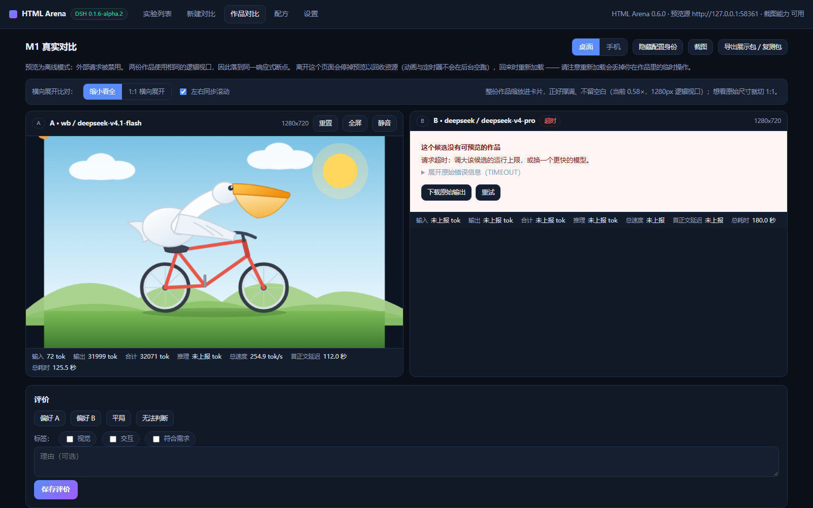
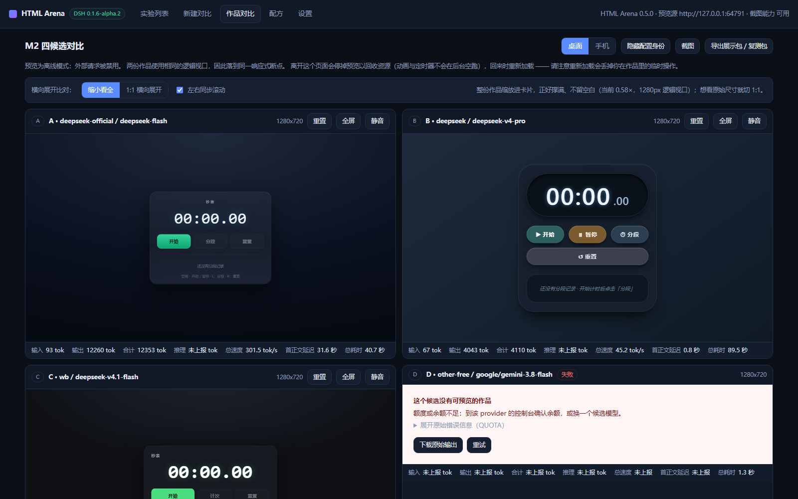
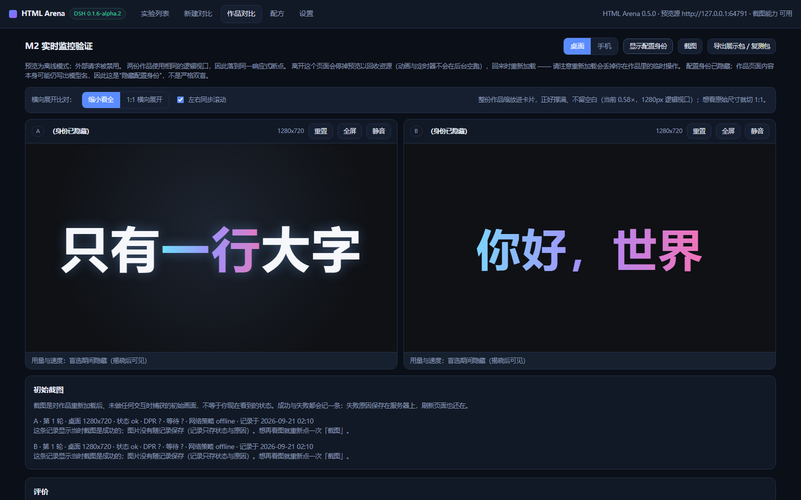

# ConfigStudio · 配置实验室

**比较什么，由你决定。效果如何，并排看。**

一个 DSH（DeepSeek Harness）Web 插件：同一道题，交给 2–4 套自定义配置生成，并排体验、盲选、保存与分享复测。

同模型换提示词或参数，不同模型保持其他设置一致，或自由搭配整套方案——你选择要改变的变量。当前支持单文件 HTML，适合动画、交互原型与创意页面。

[功能介绍](#功能介绍) · [快速开始](#快速开始) · [使用指南](docs/usage.md) · [更新记录](CHANGELOG.md) · [开发文档](docs/development.md)

**一道「鹈鹕骑自行车」，两套配置各自生成，直接在同一页操作和比较。**



## 功能介绍

### 自定义配置，决定要比较什么

每个候选都可以独立选择 DSH 中的模型服务，设置系统提示词、提示词片段、温度、输出上限与思考档位。你可以只改变一个变量，也可以自由搭配整套方案。

| 你想知道 | 怎么设置 |
| --- | --- |
| 改过的提示词效果如何？ | 同一模型，使用不同提示词 |
| 思考档位或温度会带来什么变化？ | 固定模型与提示词，调整对应参数 |
| 哪个模型更适合这道题？ | 切换模型，在支持范围内保持其他设置一致 |
| 哪套方案更适合自己的任务？ | 自由组合模型、提示词和参数 |

可用参数取决于模型与 DSH 的支持情况。只有一个可调用的模型，也能对照多套配置。

### 2–4 路生成，直接体验作品

同一道题一次发给多个候选，各自生成单文件 HTML。预览中可以点击、拖动和体验交互，观察作品在实际操作中的表现。

- **统一尺寸**：作品使用相同逻辑视口，每行两个、同行等宽，可切换手机 / 桌面视口。
- **灵活查看**：支持缩小看全、1:1 横向展开、左右同步滚动，以及单个作品重置和放大。
- **四路对照**：一次容纳四套配置，集中查看同一道题的不同实现。

**同一道「秦始皇骑北极熊」，四套配置的生成结果。**



### 隐藏身份盲选，再揭晓配置

盲选时隐藏模型、配方名，以及可能透露身份的用量与速度信息。你可以先体验作品，再记录偏好、平局或无法判断，补充视觉、交互、符合需求等评价标签与理由，最后揭晓配置。

作品内容本身仍可能透露模型身份，因此这里提供的是隐藏配置身份的盲选，不保证严格双盲。

**「动态太阳系」盲选：先看作品，再看是谁、用什么配置生成的。**



### 用量与速度，和作品一起看

每张作品卡下直接展示输入 / 输出 / 推理 token 数、总速度、首正文延迟与总耗时，方便结合效果判断等待时间和用量是否值得。

总速度按「输出 tokens ÷ 总耗时」计算，包含等待与推理阶段；上游未返回的数据标为「未上报」。盲选期间这些信息隐藏，揭晓后可见。

### 运行过程可见，超时后可以接着试

生成面板展示排队、生成中、完成与失败状态，并实时更新输出。可以取消运行、调整运行上限，或单独重跑某个候选；一个候选失败不影响其他候选的结果。

运行上限支持自动选择或手动设置。超时后可在原实验中调大上限并重跑，保留其他作品与已有评价；每次尝试记录当时的配置和上限，历史不会被新设置覆盖。每个候选每轮只做一次模型调用，不自动重试或修复作品。

### 保存配方，积累自己的配置与判断

满意的配置可以保存为「配方」，下次直接复用。修改配方会追加新版本，实验保留启动时的配置快照，方便回看当时用的究竟是哪一版。

实验历史支持按标题搜索、按类型和评价状态筛选。你可以找回上次的作品与选择理由，复制实验继续调整，或追加轮次观察结果是否稳定。

### 分享结果，也分享可复测的配置

| 导出方式 | 对方能做什么 |
| --- | --- |
| **展示包** | 解压后打开 `index.html`，查看报告、作品与初始截图，无需安装插件 |
| **复测包** | 导入题目、配方和预览 / 输出规则，用自己的 DSH 模型服务重新生成 |

复测包不混入原实验结果。导入前会校验文件与格式、检查模型是否可用；缺少模型时由用户重新选择，确认导入后也不会自动发起调用。两种包均由你自行分享。

### 保留原始输出，按需选择预览方式

可以查看和下载原始输出；模型返回多个 HTML 块时，自行选择作为作品的内容。题目或起始 HTML 超限会明确提示，不静默截断后发送。

预览提供**离线**与**受控 CDN**两种模式：默认阻止外部请求，也可按白名单放行依赖，均不改写作品代码。安装 Playwright / Chromium 后可记录初始截图；缺少截图依赖时，生成与预览仍可使用。

## 快速开始

需要 **Node.js ≥ 22.5**、已安装的 **DSH**，以及至少一个可调用的模型服务。当前验证环境为 Windows 11 + Chromium，DSH `0.1.6-alpha.2`。

插件直接从源码目录安装，无需构建。以下命令使用 PowerShell。

```powershell
git clone https://github.com/ekkkcz/dsh-configstudio.git
cd dsh-configstudio

# 安装到已有的 Web profile（将 web 替换为你的 profile 名）
dsh plugin --profile web add (Get-Location).Path
```

重启对应 profile 的 DSH，在 Web 侧栏打开 **配置对比**：

1. 写一道题，或点击 **试一个示例**。
2. 设置 2–4 套配置，点击 **开始生成**。
3. 进入对比，体验作品、盲选并保存评价；按需保存配方或导出。

> 新建 profile 时，请先从默认 Web 配置创建，再安装插件，避免缺少 Web 界面。详见[安装与排查](docs/usage.md#安装与排查)。

想先体验流程，可以运行模拟模式，无需调用模型：

```powershell
node scripts/dev-server.mjs --port 8790
```

打开 <http://127.0.0.1:8790/configstudio/api/ui>。该模式使用模拟结果，不产生模型调用费用。

## 使用说明

- **费用**：插件免费，模型调用按所用服务计费。每个候选每轮一次调用，失败不自动重试。
- **数据**：实验保存在本机，凭据由 DSH 管理；模型请求发送至你配置的服务。导出包由你自行分享。
- **当前范围**：支持单次生成对照，尚不支持参考图输入、批量多次采样、交互后截图或真实工具 / Skill 调用对照。

更多操作、截图依赖、超时与空白作品排查，见[使用指南](docs/usage.md)。最新变更见[更新记录](CHANGELOG.md)。

## 文档

| 文档 | 内容 |
| --- | --- |
| [使用指南](docs/usage.md) | 安装、对照、配方、导出与常见问题 |
| [开发与验证](docs/development.md) | 本地运行、测试与回归检查 |
| [架构说明](docs/architecture.md) | 模块分工与数据流 |
| [DSH 接入](docs/dsh-integration.md) | 宿主接口与兼容性记录 |
| [验收记录](docs/acceptance.md) | 验证结果与已知缺口 |
| [截图与演示](docs/evidence/demo/) | 实际生成结果与演示素材 |

## 许可

[MIT](LICENSE) · [第三方说明](docs/third-party-notices.md)

本项目为独立插件，与 DeepSeek Harness 官方仓库无隶属关系。
